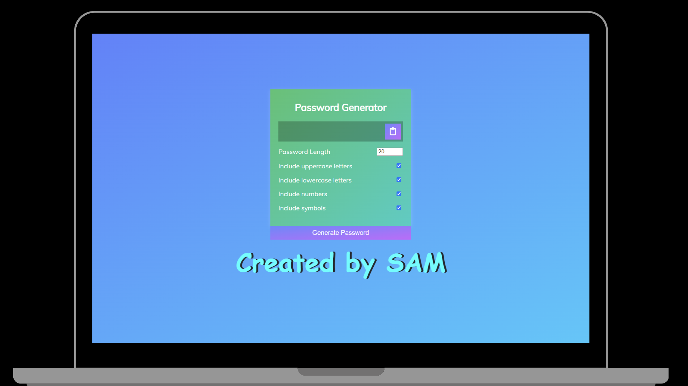
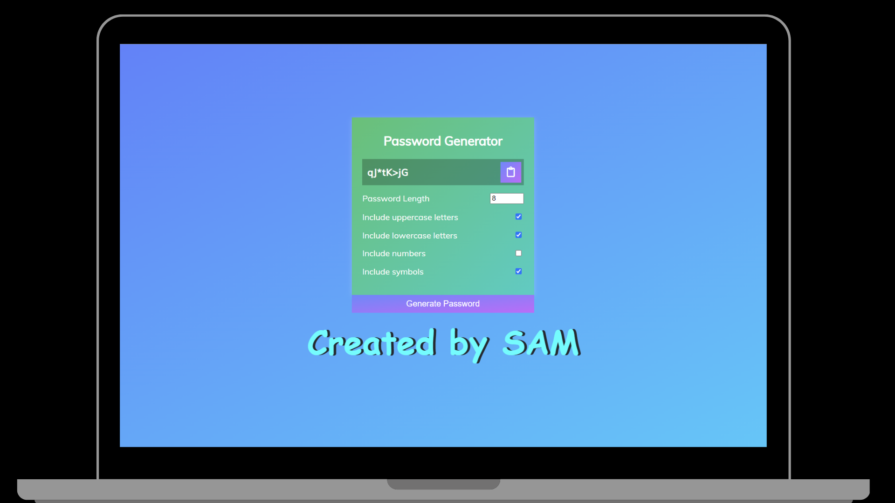

# Password Generator Application

Password Generator App written in HTML, CSS, and JavaScript .

## Use of the Project:

This app helps to create strong random passwords which can be easily used during authentication.

## Tech Stacks Used:

- HTML5
- CSS3
- JavaScript

## Screenshots

 

